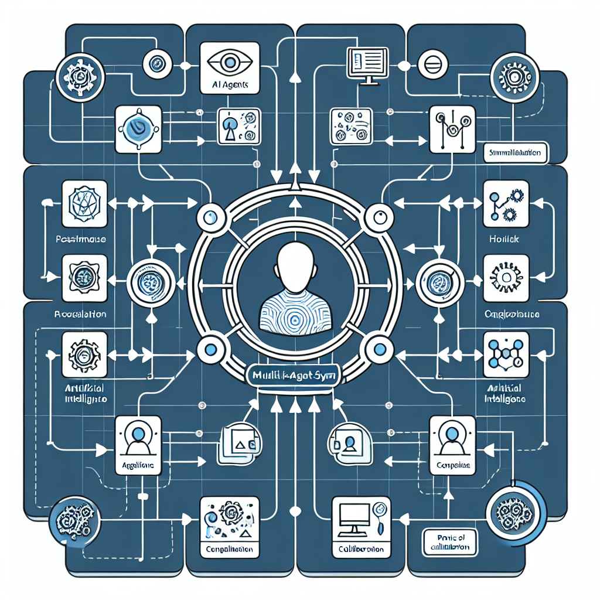
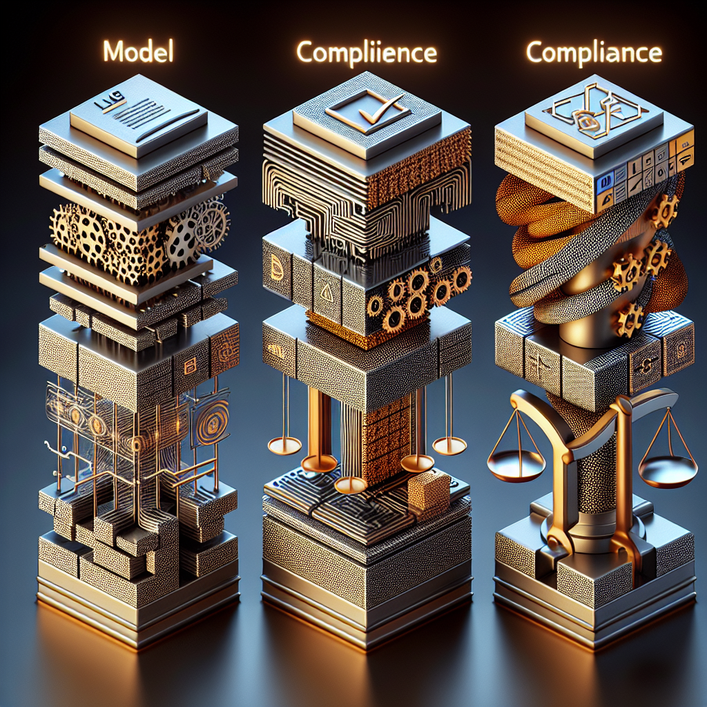

Artificial Intelligence had flashy breakthroughs before — but 2026 feels different. It’s not just about what's possible anymore; it's about what delivers real value, operates safely, and integrates deeply into business and daily life. If you're building with ABP, dotnet, or in enterprise architecture, these are the trends people are **actually** looking at this year.

## What’s Changing This Year

- Generative AI served as the headline trend in past years. Now, the conversation is shifting to **agentic and autonomous AI** — agents that do work, not just generate content. ([atera.com](https://www.atera.com/blog/ai-trends/?utm_source=openai))
- Hype terms like "ChatGPT" and pure "generative AI" are losing airtime. Business value, trust, safety, and context are stepping up. ([aiweekly.co](https://aiweekly.co/learning-ai/artificial-intelligence/ai-trends-2015-2026-what-11-years-data-reveal?utm_source=openai))
- Edge and physical AI — robotics, IoT, on-device model inference — are moving from lab demos into production. ([atera.com](https://www.atera.com/blog/ai-trends/?utm_source=openai))

## Key Topics You Should Watch

Here are the AI trends shaping enterprise, engineering, and strategy in 2026. Where ABP (or any modular DDD-style .NET solution) fits in, I’ll drop context along the way.

### 1. Agentic & Autonomous AI Systems

What this means:
- Agents that can carry out tasks based on goals with minimal human input — like scheduling, data entry, complying with policies. ([atera.com](https://www.atera.com/blog/ai-trends/?utm_source=openai))
- Multi-agent systems: agents working together, chaining tasks, orchestrating workflows. More than just prompts—they need coordination, error handling, role definitions. ([techtarget.com](https://www.techtarget.com/searchEnterpriseAI/tip/AI-topics-that-enterprise-leaders-need-to-know?Offer=ab_MeteredFormCopyEoc_var3&utm_source=openai))

Why it matters:
- Enterprise apps built with layered architectures (think ABP Domain, Application, UI layers) benefit: agents can be injected, orchestrated, wrapped. It pushes business logic to be more explicit.
- Forces you to think more about traceability, observability & failure modes.

When to use / When NOT to use:

| When to use | When NOT to use |
|---|---|
| Repetitive workflows that span systems (ERP, CRM, doc tools) | For ultra-sensitive data without strong governance
| Domains where decisions can be safely delegated / audit-logged | Solo tasks where simplicity beats orchestration overhead |

### 2. Specialization & Vertical AI

Summary:
- Instead of one model trying to do everything, we're seeing more domain-specific models (health, law, finance, etc.) that optimize on context. ([indigo.ai](https://indigo.ai/en/blog/ai-trends-2026?utm_source=openai))
- Vertical AI platforms: tools tailored to particular industries or verticals. Developers will choose these over generic APIs. ([journeybee.io](https://www.journeybee.io/resources/the-top-14-ai-trends-and-predictions-to-watch-in-2026?utm_source=openai))

Impact for ABP/.NET devs:
- You’ll want to pick or build domain layers, modular plug-ins, or microservices that align with vertical requirements (e.g. compliance, data formats). ABP’s modularity plays well here.
- Performance constraints — specialized models may be lighter, but still need deployment & scaling planning.

### 3. AI Governance, Trust & Safety (AISecOps)

What’s on deck:
- More regulation. Lawmakers and businesses are demanding safe-by-design systems, transparency, audit trails. ([techtarget.com](https://www.techtarget.com/searchEnterpriseAI/tip/AI-topics-that-enterprise-leaders-need-to-know?Offer=ab_MeteredFormCopyEoc_var3&utm_source=openai))
- Security around AI: adversarial attacks, prompt injection, model misuse. Teams specialized in AI security operations are emerging. ([techtarget.com](https://www.techtarget.com/searchEnterpriseAI/tip/AI-topics-that-enterprise-leaders-need-to-know?Offer=ab_MeteredFormCopyEoc_var3&utm_source=openai))
- Ethics, bias, sustainability (energy usage, carbon footprint). These issues are no longer optional. ([techtarget.com](https://www.techtarget.com/searchEnterpriseAI/tip/AI-topics-that-enterprise-leaders-need-to-know?Offer=ab_MeteredFormCopyEoc_var3&utm_source=openai))

Tips:
- Build with logs, explainability, and monitoring from day one. ABP’s auditing & logging modules can help.
- Design boundary layers: content moderation, role-based access, and data labeling oversight.

### 4. Multimodal & Physical AI

Definition:
- AI that handles more than text: combining vision, audio, sensors, physical movement. ([atera.com](https://www.atera.com/blog/ai-trends/?utm_source=openai))
- Physical AI: robotics, devices, edge computing — running AI inference near or at the source. Less latency, more privacy. ([yarnit.app](https://www.yarnit.app/post/the-future-of-artificial-intelligence-2026-ai-trends?utm_source=openai))

Why it’s viable now:
- Hardware improvements, cheaper sensors. Edge GPUs & inference chips are more accessible. ([yarnit.app](https://www.yarnit.app/post/the-future-of-artificial-intelligence-2026-ai-trends?utm_source=openai))
- Simulation + real-world training pipelines. Vision + action tasks becoming more robust. ([yarnit.app](https://www.yarnit.app/post/the-future-of-artificial-intelligence-2026-ai-trends?utm_source=openai))

Challenges:
- Resource constraints. Power, compute, latency.
- System integration. Device drivers, sensor calibration, physical safety.

### 5. From Models to Infrastructure & Business Value

This is where many projects succeed or flop.

Key shifts:
- Foundational models are becoming commoditized. Advantage = in infrastructure, deployment, data pipelines, integration. ([indigo.ai](https://indigo.ai/en/blog/ai-trends-2026?utm_source=openai))
- Copilot-studio or low-code tools are rising: business experts building agents without being ML experts. ([journeybee.io](https://www.journeybee.io/resources/the-top-14-ai-trends-and-predictions-to-watch-in-2026?utm_source=openai))
- Measuring ROI: time saved, error reduction, revenue uplift. Not just technical benchmark scores. ([axios.com](https://www.axios.com/2026/01/01/ai-2026-money-openai-google-anthropic-agents?utm_source=openai))

For .NET / ABP practitioners:
- Invest in model deployment pipelines, CI/CD, versioning of models / prompt templates.
- Use modular design so you can swap models or agents without massive rewrites.

## What’s NOT Getting as Much Attention (Compared to Before)

- Pure text-only generative models for fun/gimmick are getting less buzz. ([aiweekly.co](https://aiweekly.co/learning-ai/artificial-intelligence/ai-trends-2015-2026-what-11-years-data-reveal?utm_source=openai))
- Excessive focus on headline benchmark scores. Real-world accuracy, robustness, latency matter more. 
- Tools without clear governance, datasets with poor provenance — less acceptable in serious enterprise work.

## Why It All Matters (Especially For Enterprise / ABP Users)

- Users & customers expect AI that *does* things, not just suggest. If you build apps or services, integrating agentic behavior will become a competitive differentiator.
- Legal/regulatory risk: non-compliant AI can cost reputation, fines, business licenses. Good governance is insurance.
- Performance & cost: physical AI, edge inference, multimodality push us to optimize our stacks (just like .NET wants us to do).

## TL;DR

- **Agentic / Autonomous AI** is the breakout: agents that act, not just generate.
- **Vertical & Multimodal specialization** wins — domain-specific models and AI that includes vision, sensors, audio.
- **Governance, Trust & Safety** are no longer afterthoughts—they’re core requirements.
- **Business value, infrastructure, integration** matter more than raw model metrics.
- **Physical & Edge AI** are mainstreaming: robots, on-device inference, smarter sensors.

If any of this sounds like where your team’s going, ABP’s modular architecture, Domain-Driven Design, and extensibility features are very relevant. Curious what you want to explore in more detail (agents? vertical models? governance tooling?)—I can dig into that too.