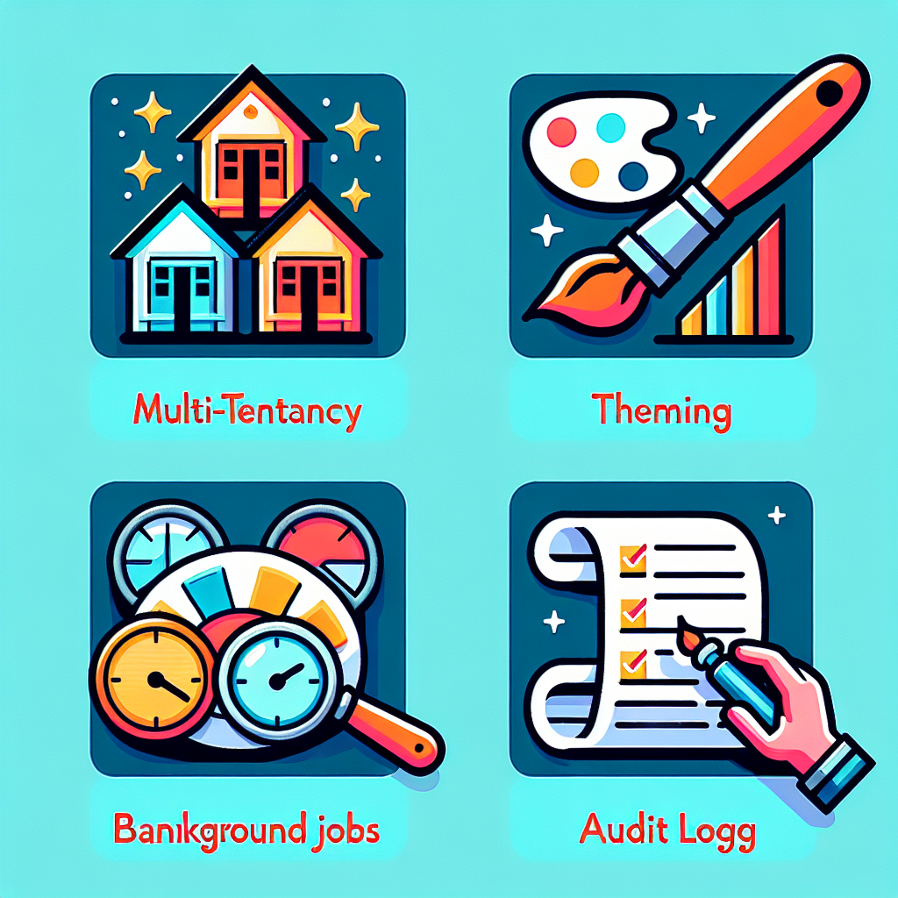
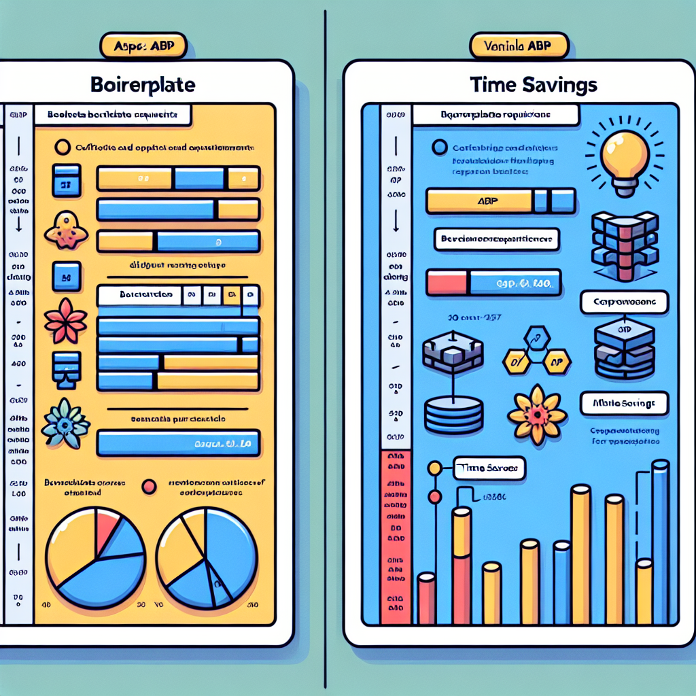

Developers hear “ABP” more now, especially in enterprise .NET circles. But what IS ABP exactly, and why is it getting traction? If you're evaluating frameworks or building applications at scale, understanding ABP matters.

This article explains:

- what ABP Framework is and what it gives you out of the box,
- how it fits in the .NET ecosystem,
- when it shines—and when it might be overkill.

## What Is ABP Framework?

ABP (sometimes called ABP.IO) is an open-source, opinionated application framework built on top of ASP.NET Core. Think of it as a **starter kits**, **architectural guide**, and **library of pre-built modules** all rolled into one. It handles a lot of “plumbing” so you can focus on business logic. ([abp.io](https://abp.io/?utm_source=openai))

Key traits:

- Modular: ABP encourages splitting functionality into reusable modules, each with its own UI, API, data models, etc. ([abp.io](https://abp.io/features?utm_source=openai))
- Built-in infrastructure: multi-tenancy, authentication & authorization, audit logs, background jobs, distributed event bus, theming, test projects—all ready to go. ([abp.io](https://abp.io/features?utm_source=openai))
- Uses standard paradigms: Domain-Driven Design (DDD), layered architecture, dependency injection, etc.—so knowledge is transferable. ([abp.io](https://abp.io/docs/commercial/7.0/why-abp-io-platform?utm_source=openai))

## Key Features at a Glance

Here are some features that tend to win people over with ABP, especially in enterprise or SaaS settings:

| Feature | What It Means | Why It Helps |
|---|---|---|
| Multi-tenancy | Supports isolating data & behavior per tenant. Can use single database, multiple, hybrid. | Great for SaaS products where tenants share infrastructure but need separation. ([abp.io](https://abp.io/features?utm_source=openai)) |
| Modular Architecture | Build features in modules—UI, API, database, domain logic separately. | Code organization, team boundaries, reusability. ([abp.io](https://abp.io/features?utm_source=openai)) |
| Auto REST APIs & Dynamic Client Proxies | You define services in C#, ABP can expose APIs automatically, and generate client proxies. | Cuts boilerplate, speeds up front-end/back-end work. ([abp.io](https://abp.io/features?utm_source=openai)) |
| Cross-cutting concerns included | Logging, caching, validation, permissions, settings, localization, etc. | No need to reinvent these for every project. Less error-prone. ([abp.io](https://abp.io/features?utm_source=openai)) |
| Full stack and UI options | Works with MVC, Blazor, Angular, Razor pages. Theming, UI bundles, etc. | Flexibility in choosing front ends while keeping back end solid. ([abp.io](https://abp.io/features?utm_source=openai)) |

## ABP vs “Start From Scratch” in .NET

If you build a large .NET application from scratch, you’ll spend significant time on:

- Middleware setup, authentication, error logging,
- Organizing layers (Domain, Application, Infrastructure, UI),
- Defining multi-tenant behavior,
- Setting up background jobs or scheduled tasks,
- Localization, settings/configuration per user or tenant,
- Reusable modules for future features.

ABP gives you most of those as templates or built-ins. That means steeper learning early, but much faster progress later. ([abp.io](https://abp.io/docs/commercial/7.0/why-abp-io-platform?utm_source=openai))

## When to Use ABP—and When NOT To

### When ABP is a good fit:

- You’re building a **medium-to-large business app** or SaaS product with many domains or bounded contexts.
- You need multi-tenant support or expect your solution to scale across tenants.
- Teams want cohesive standards: consistent module layout, shared cross-cutting services.
- You want to leverage front-end + back-end integration (e.g. Angular + ASP.NET Core, or Blazor) without wiring everything manually.
- Architectural quality (clean layering, domain logic) matters.

### When ABP might be overkill:

- For very small, throw-away apps or prototypes where speed beats architecture.
- If performance constraints are such that any abstraction overhead matters—though ABP is pretty optimized, some overhead exists.
- You have existing frameworks or policies that clash (e.g. strict custom DI container, deep legacy constraints).
- The learning curve: ABP has conventions and patterns you'll need to learn (module boundaries, dependency lifetimes, etc.). Not as lightweight as just vanilla ASP.NET Core.

## How ABP Fits In with Other .NET Tools & Frameworks

- **Entity Framework Core / NHibernate**: ABP supports EF Core and other ORMs. It doesn’t force one but integrates tightly with EF Core out-of-box. ([abp.io](https://abp.io/features?utm_source=openai))
- **Authentication/Identity**: ABP supports ASP.NET Core Identity, OpenID, custom auth systems. It gives you a pre-wired permission system. ([abp.io](https://abp.io/features?utm_source=openai))
- **Front-ends & UI Frameworks**: You can build with Angular, Blazor, or Razor Pages. Themes, bundles, tag helpers make UI work more predictable. ([abp.io](https://abp.io/features?utm_source=openai))
- **Testing**: Comes with templates and abstractions for unit & integration tests. Helps enforce good test hygiene. ([abp.io](https://abp.io/docs/commercial/7.0/why-abp-io-platform?utm_source=openai))

## Getting Started Basics

Here’s what a minimal ABP setup looks like:

1. Install the ABP CLI (command line tool to create projects/modules, etc.)
2. Scaffold a new solution using `abp new MyApp` with desired UI and database providers. ABP generates layered projects for domain, application, API, etc. ([abp.io](https://abp.io/features?utm_source=openai))
3. Explore built-in modules: identity (users/roles), tenant management (if needed), localization.
4. Build features via modules: define your domain entities, application services, DTOs, REST controllers (or auto-generated), UI pages/components.
5. Use ABP’s pre-configured cross-cutting aspects: validation, logging, settings. Don’t define them yourself unless needed.
6. If scaling to SaaS, configure multi-tenant behavior (database isolation, data filters, etc.).

## Pros, Cons, & Trade Offs

| Pros | Cons / Trade-Offs |
|---|---|
| Saves time: avoids reinventing common infrastructure | Learning curve to master its architecture/conventions |
| Modules allow code reuse and cleaner organization | Some features may be more than you need for small apps |
| Consistent cross-cutting services—security, logging, etc. | Performance overhead (minimal but present) versus ultra-lean apps |
| Good community and ongoing updates; keeps pace with .NET versions | More dependencies to keep updated; upgrade cost between major ABP versions |

## Summary & Verdict

If you're building real-world, long-living applications—say SaaS, enterprise dashboards, multi-tenant platforms—ABP gives you serious head-start. It doesn't replace learning ASP.NET Core, but it wraps many patterns and common tasks into polished conventions, modules, and infrastructure. If you're doing small or temporary apps, or need extreme simplicity, vanilla ASP.NET Core might still be more straightforward.

## TL;DR

- ABP is an opinionated, open-source framework built on ASP.NET Core that provides modular architecture, multi-tenant setups, REST API auto-generation, and many built-in services. ([abp.io](https://abp.io/features?utm_source=openai))
- It saves you boilerplate for identity, authorization, logging, background processing, theming, etc. ([abp.io](https://abp.io/features?utm_source=openai))
- Best for medium-to-large business or SaaS apps, especially where modularity, maintainability, and scale matter.
- Not ideal when you want minimal apps with near zero abstraction, or have legacy constraints that conflict with ABP conventions.
- Works well with the familiar .NET stack: EF Core, Identity, Blazor/Angular, DI, etc.

If you're curious to try it, check out the ABP documentation and use the CLI to spin up a starter template—you can judge whether the framework “fits your groove” once you've seen it in action. Happy coding! 😊