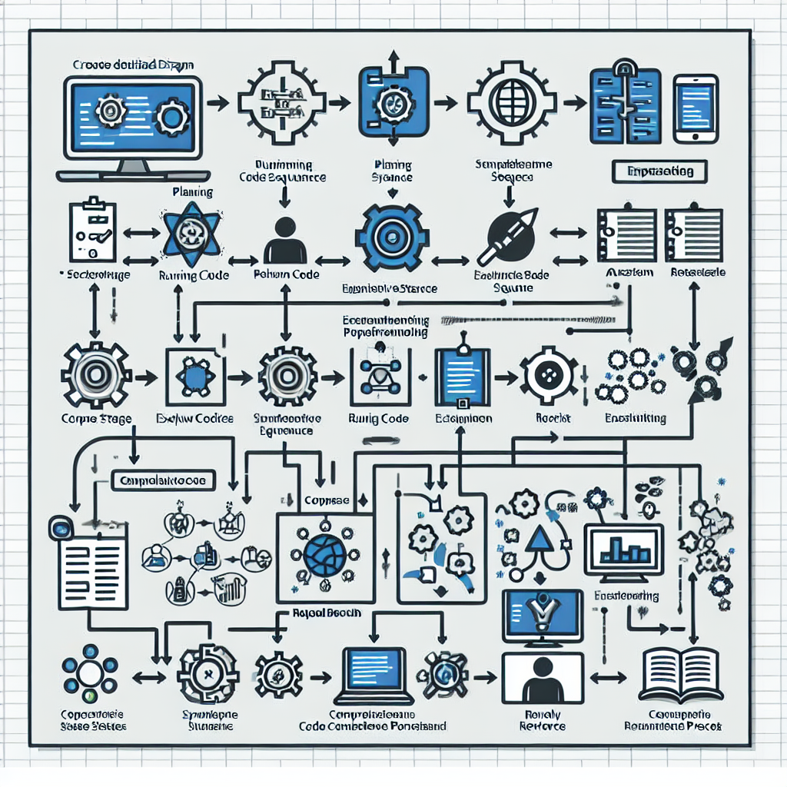
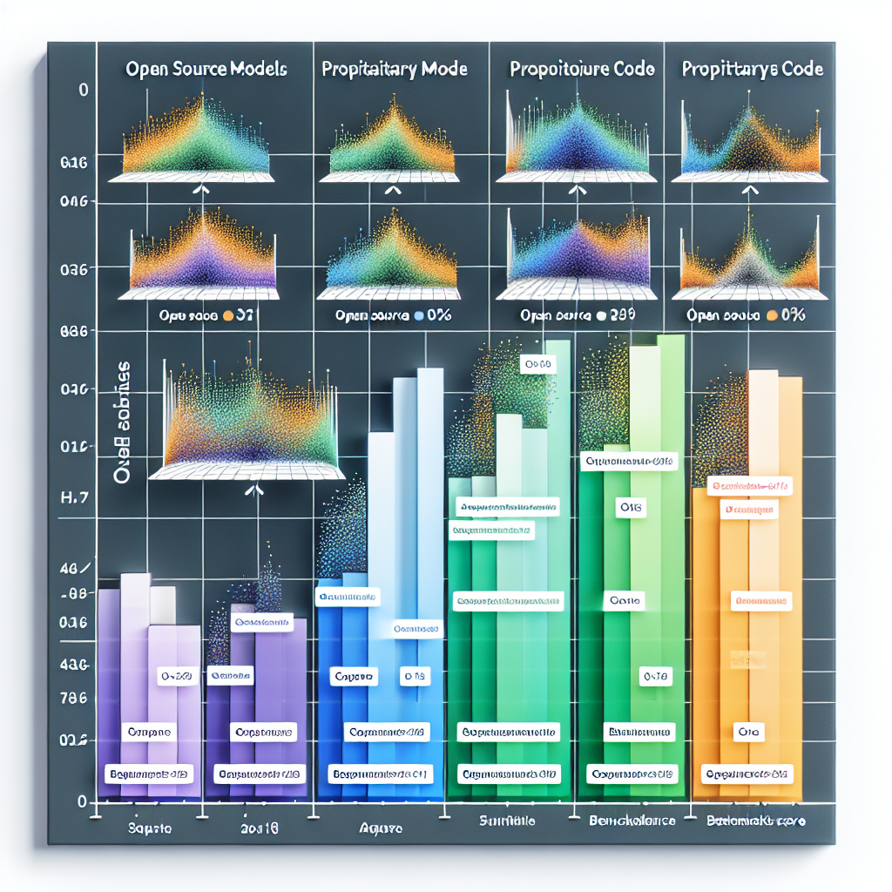

Intro
------
If you’re a developer in 2026, “AI models that write code” isn’t sci-fi—it’s part of your dev environment. But not all models are made equal. Which one should you actually use depends on what you need: refactoring messy legacy systems, spin up frontend UIs fast, maintaining huge codebases, or staying within tight cost and privacy constraints.

In this article, we'll compare 2026’s top AI coding models, how they perform, and when each shines—especially through the lens of ABP Framework or similar modular .NET / enterprise architectures.

We’ll cover:

- Top models you’ll hear about this year
- What real devs say: concrete benchmarks & use cases
- How to pick a model (context window, speed, price, open-source vs proprietary)
- When to use one over another (especially in ABP or enterprise apps)

Together, you can avoid hype and pick the tool that *actually* helps you ship.

## What’s changed in 2026

You should know this because model capabilities shifted substantially:

- Context windows exploded. Models like Anthropic’s Claude **Opus 4.6** can now handle up to **1 million tokens**, so they can see *whole repos* when generating code. ([itpro.com](https://www.itpro.com/technology/artificial-intelligence/anthropic-reveals-claude-opus-4-6-enterprise-focused-model-1-million-token-context-window?utm_source=openai))
- New “agentic” workflows are everywhere—models aren’t just writing snippets; they plan tasks, call APIs, debug multiple files. ([faros.ai](https://www.faros.ai/blog/best-ai-model-for-coding-2026?utm_source=openai))
- Open-source competitors are catching up: GLM-5 (Z.ai) now rivals proprietary models on many coding benchmarks. ([creativeainews.com](https://www.creativeainews.com/articles/best-ai-coding-tools-2026/?utm_source=openai))
- Model cost and latency still matter—big models are not free, and runtime matters for fast feedback in IDEs. ([freeapihub.com](https://freeapihub.com/blog/ai-coding-tools-developers-use-2026?utm_source=openai))

## The Front-Runners (What Developers Are Choosing)

Here are the big names in 2026 for coding tasks, their strengths and typical weak spots:

| Model | What It’s Great At | Where It Trips Up / Trade-offs |
|---|---|---|
| **GPT-5.4 / GPT-5.3-Codex** (OpenAI) | Extremely strong for complex reasoning, large refactors, architecture suggestions, long context via 400-k token windows. Good for ensuring consistency and correctness. Used via GitHub Copilot and as standalone Codex agent. ([windowscentral.com](https://www.windowscentral.com/artificial-intelligence/openai-chatgpt/github-copilot-openai-gpt-5-4-in-vscode?utm_source=openai)) | Expensive for long sessions; larger latency; sometimes over-engineers for small tasks; may be overkill for simple tools or small scripts. |
| **Claude Opus 4.6** (Anthropic) | Built for enterprise tasks, great multi-file refactors, strong context, good for agentic workflows, and tends to “understand intent” well. ([itpro.com](https://www.itpro.com/technology/artificial-intelligence/anthropic-reveals-claude-opus-4-6-enterprise-focused-model-1-million-token-context-window?utm_source=openai)) | Slightly behind in speed vs some lighter models; pro pricing tiers required for heavy usage; occasionally less polished UI integrations than some competitors. |
| **Gemini 3 Pro / 3.1** (Google) | Big-context + multimodal possibilities (think code + diagrams + docs), useful for data-science workflows, design-informed coding. Fast experimentation. ([faros.ai](https://www.faros.ai/blog/best-ai-model-for-coding-2026?utm_source=openai)) | Context windows maybe less consistent across all surfaces; cost can spike; sometimes “good enough” rather than “best” for deep correctness requirements. |
| **GLM-5 / GLM-4.7** (Z.ai open-source) | Best open-source options; run locally or self-hosted; fewer data privacy concerns; competitive in benchmarks (SWE-Bench Verified, etc.). ([creativeainews.com](https://www.creativeainews.com/articles/best-ai-coding-tools-2026/?utm_source=openai)) | Hardware requirements are higher; latency can vary; fewer off-the-shelf ecosystem integrations; sometimes lower polish in prompt engineering. |
| **Lightweight / specialized models** (e.g. Claude **Sonnet 4.6** / **Haiku 4.5**, or lower-parameter variants) | Ideal for rapid prototyping, small tasks, or tight feedback loops. Good for REPL-style work, UI tweaks. Lower latency and cost. ([talkory.ai](https://www.talkory.ai/blog/ai-for-developers-which-model-writes-the-cleanest-code-in-2026?utm_source=openai)) | Not great for large scale refactors; may lose context; higher risk of code that needs substantial human review. |

## Choosing Based on What You Actually Build

Here’s a decision guide tuned for enterprise-scale or modular architecture work (like ABP Framework–style applications). Answer these, then pick.

| Question | Key Metric / Feature That Matters Most |
|---|---|
| How big are your codebases (& dependencies) / how many files touched per change? | Context window (tokens), repo awareness, ability to reference docs/libraries etc. |
| Is correctness more important than speed? | Benchmark scores (like pass rates on HumanEval / SWE Bench), quality of diff review tools, bug costs. |
| Are you running in a sensitive domain (finance, healthcare etc.)? | Open-source / self-hosting or privacy terms; traceability; auditability. |
| What’s your cost / latencies budget? | Subscription fees; per-token or per-credit billing; model efficiency. |
| Do your tools need to integrate into IDEs, pipelines, agents, or ABP modules? | Plugin support, agentic capabilities, multi-file refactoring, build/test hooks. |

## In Practice: Picks for Common Developer Scenarios

Here are what I’d pick in several real-world settings. If you use ABP, think in terms of layers/modules/domain components.

| Scenario | Model & Why |
|---|---|
| Maintaining / refactoring a large ABP-based enterprise system (many modules, libraries, generics, cross-cutting concerns) | **Claude Opus 4.6** or **GPT-5.4**. Need long context, ability to reason over many files; whole feature rewrites; careful correctness. |
| Rapid MVP or frontend component work (views, UI, data inputs) | A lightweight model (Sonnet 4.6 or Haiku, or maybe a lower-cost GPT-Codex variant). Speed and cost matter more. |
| Data-science, ML, or adding BI dashboards + analytics in your ABP app | **Gemini Pro** might give you best blend: multimodal, good at Python / notebooks / reading code + docs. |
| Maximum privacy / compliance: regulated industry, on-prem environments | **GLM-5** self-hosted; you trade off some polish but gain control. |
| CI/CD / agentic tasks / tests / code review automation | Models with agentic features: Opus 4.6, GPT-Codex (especially in Copilot or Codex app); tools like Claude Code and Cursor which embed agents. |

## When to Use / When *NOT* to Use Certain Models

Use models when:

- You have well-defined goals (migrations, refactors, new features) and need help scaffolding or consistency.
- Human review and testing are baked in. Never fully trust auto-generated code without tests.
- You need to accelerate iteration, scaffold boilerplate, or generate repetitive patterns.

Don’t use (or beware) when:

- The task is tiny and blind autocomplete may be faster (e.g., trivial UI tweaks or small bug fixes). Big models add latency.
- You have strict security or compliance needs and aren’t confident in privacy guarantees of the provider.
- Your hardware or budget can’t support large-context or agentic workflows—cost per token, per model call, etc., matter.

## How ABP Framework Users Can Maximize Benefit

Since so many ABP apps are modular, layered, plugin-based, here are ABP-specific tips:

- Use the model to generate individual modules (application layer, domain layer), then wire them together by hand so you preserve decoupling and layers.
- Autofill entity & DTO code, mapping, CRUD scaffolding: great win from smaller models, freeing mental bandwidth for architecture decisions.
- Use agentic features / tests generation to automate and guard module boundary contracts, integration points.
- Embed models in CI pipelines to do code style / security checks ala pull-request bots—but set them up with strict review. |

## Real Sphere: Benchmark Numbers & Model Comparisons

Here are a few data points from benchmarks & real usage logs as of early 2026:

- Claude Opus 4.6 hits high scores on coding benchmarks—Terminal-Bench 2.0, GDPval-AA Elo, etc.—with very strong multi-file performance. ([itpro.com](https://www.itpro.com/technology/artificial-intelligence/anthropic-reveals-claude-opus-4-6-enterprise-focused-model-1-million-token-context-window?utm_source=openai))
- GLM-5 (Z.ai) scores around **77.8% on SWE-Bench Verified**, making it competitive with the premium models. ([creativeainews.com](https://www.creativeainews.com/articles/best-ai-coding-tools-2026/?utm_source=openai))
- Talkory’s evaluation finds that **GPT-5.4** produces the cleanest code (Python/JS/SQL) among the big models, while models like Claude Sonnet 4.6 excel in large codebase refactoring & maintaining context. ([talkory.ai](https://www.talkory.ai/blog/ai-for-developers-which-model-writes-the-cleanest-code-in-2026?utm_source=openai))
- Home user / startup workflows often mix models—fast, lighter models for prototyping and premium ones for production-critical changes. ([freeapihub.com](https://freeapihub.com/blog/ai-coding-tools-developers-use-2026?utm_source=openai))

## TL;DR

- For serious enterprise or ABP-style modular work: **Claude Opus 4.6** or **OpenAI’s GPT-5.4/Codex** are top picks for correctness, context, and integration.
- Want speed, lower cost, or doing UI/prototype features? Use lighter models (Sonnet / Haiku / lower tiers of GPT-Codex)
- If you need privacy or self-hosting: GLM-5 or similar open-source families are good enough to replace proprietary models in many cases.
- Use multiple models: one for prototyping, one for production / refactoring, one for testing / agentic tasks.
- Always keep tests, reviews, and layering (in ABP apps) strong—don’t offload critical thinking to the model.

If you want help matching an AI model specifically for your ABP project (modules, plugins, runtime constraints), I’ve got some suggestions—happy to dig in with your setup! ;)