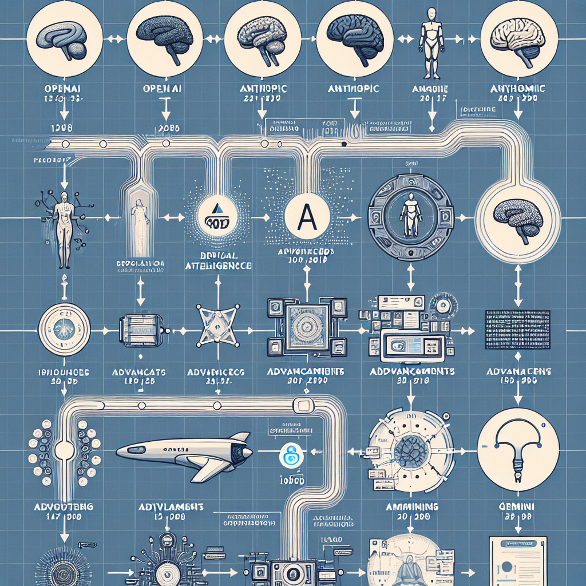

In early 2026, AI-assisted coding isn't just autocomplete anymore—it’s closer to having a smart junior engineer who helps you think through architecture, refactor, debug across files, and sometimes even manage repositories. But “best model” really depends on *how you code*, *what you build*, and *what you tolerate in trade-offs*. Here’s how the top models stack up, and how to pick for your workflow (including ABP Framework users). 

---

## What’s changed in AI coding models lately

- OpenAI released **GPT-5.5 (“Spud”)** in April 2026, with strongest gains in coding, long-context reasoning, and efficiency. ([axios.com](https://www.axios.com/2026/04/23/openai-releases-spud-gpt-model?utm_source=openai))  
- Anthropic’s **Claude Opus 4.5/4.6** and **Sonnet 4.5/4.6** keep being cited as top models for multi-file refactors, agentic workflows, and enterprise readiness. ([itpro.com](https://www.itpro.com/technology/artificial-intelligence/anthropic-announces-claude-opus-4-5-the-new-ai-coding-frontrunner?utm_source=openai))  
- Google’s **Gemini 3.1 Pro** offers improved reasoning, large context windows, and broader availability via APIs. ([androidcentral.com](https://www.androidcentral.com/apps-software/google-just-doubled-its-ai-reasoning-power-with-the-surprise-launch-of-gemini-3-1-pro?utm_source=openai)) 
- Open models (like StarCoder 2, GLM-5) are gaining ground, especially for self-hosting, privacy, or more budget‐sensitive use cases. ([techaimag.com](https://www.techaimag.com/foundation-models/top-ai-models-2026-best-text-code-creative-search-ai-reviewed?utm_source=openai)) 
- Cost, latency, and hallucination remain concerns. Trade-offs between speed vs precision are front and center. ([skillboss.co](https://www.skillboss.co/docs/blog/best-ai-models-for-code-generation-2026?utm_source=openai)) 

---

## Top models that devs are using (and why)

Here are some of the models being widely used in 2026—and what they shine at.

| Model | Strengths | Weaknesses / Trade-offs |
|---|---|---|
| **GPT-5.3-Codex** (OpenAI) | Very strong at agentic workflows: multi-file changes, generating tests, debugging; speed improved significantly over earlier Codex models. ([en.wikipedia.org](https://en.wikipedia.org/wiki/GPT-5.3-Codex?utm_source=openai)) | Higher cost, more latency when dealing with huge context. May over-assume patterns when project structure differs from training sets. |
| **Claude Opus 4.6 / Sonnet 4.6** (Anthropic) | Excellent long context windows (hundreds of thousands to ~1 million tokens), strong understanding of project structure, reliable with refactors. Claimed top scores on benchmarks like SWE-Bench. ([itpro.com](https://www.itpro.com/technology/artificial-intelligence/anthropic-announces-claude-opus-4-5-the-new-ai-coding-frontrunner?utm_source=openai)) | Slower in generating responses, higher token cost; sometimes more “planning” than execution (you might need to break tasks down explicitly). |
| **Gemini 3.1 Pro** (Google) | Balanced model: fast reasoning, strong multimodal support, good for code + docs + design artifacts; often cheaper than the “premium” models at high quality. ([androidcentral.com](https://www.androidcentral.com/apps-software/google-just-doubled-its-ai-reasoning-power-with-the-surprise-launch-of-gemini-3-1-pro?utm_source=openai)) | Still improving in certain edge cases, e.g. large base-code refactoring; performance varies by task. |
| **GLM-5, StarCoder 2, and open‐source versions** | Amazing if you want privacy, self-hosting, or cost control; decent benchmarks especially when tuned or when latency matters. ([techaimag.com](https://www.techaimag.com/foundation-models/top-ai-models-2026-best-text-code-creative-search-ai-reviewed?utm_source=openai)) | Generally less polished, fewer “agentic” features out of the box; some limitations in tool integration, fewer supported languages in certain variants. |
| **GPT-5.4 / newer variants** | Latest experiments show cleanest code across popular languages; fast delivery when task is prepended with smaller prompts. ([talkory.ai](https://www.talkory.ai/blog/ai-for-developers-which-model-writes-the-cleanest-code-in-2026?utm_source=openai)) | Adoption still ramping; pricing and availability can be less stable; sometimes less mature in edge‐case error detection. |

---

## How this matters if you're using ABP Framework or building enterprise/modular apps

ABP Framework projects often involve multi‐layer architecture (domain, application, web, modules), large codebases, DDD practices, cross-cutting concerns (security, logging, permissions), and microservices. For those, you’ll want a model that: 

- Can maintain understanding across many files and even separate services  
- Generates consistent code style/conventions across modules  
- Helps you think in terms of architecture (e.g. module boundaries, domain boundaries) rather than just endpoints  
- Assists in test generation, migrations, versioning—not just “build this .cs file” tasks  

If your project fits that pattern, leaning toward **Claude Opus/Sonnet** or **GPT-5.3-Codex / GPT-5.5** is sensible. For smaller projects, experiments, or style-oriented work, gemini or open-source may offer enough juice. 

---

## What to optimise for: Speed, cost, context, correctness

Which criteria matter most depends on your priorities. Here's a quick checklist: 

| What you care about most | What to pick / optimise | What to watch out for |
|---|---|---|
| **Large refactors / architecture shifts** | High context window (>200K tokens), strong codebase awareness (Opus 4.6, Codex) | Cost per token, latency     |
| **Fast iteration / bug fix-driven workflow** | Lower latency models, variants like GPT-5.4 or smaller clones, maybe open source | Sacrifice on worst-case correctness; more prompts needed to validate. |
| **Code style / maintainability** | Models known for clean, idiomatic output (Sonnet, GPT-5.4) + prompt engineering | Need explicit instructions; review often. |
| **Privacy / on-premises / regulation** | Open source (GLM-5, StarCoder), fine-tuning closed models if allowed | You might lose access to the newest features; responsibility for oversight. |
| **Cost sensitivity** | Use “mini” or “light” versions, or mix high cost/high performance for big tasks and cheaper models for trivial ones | Hidden costs: token count for refactors, overhead in reviewing incorrect outputs. |

---

## Real examples: which model for which task

- **Adding ABP module system to an existing project** → Need context across solution files, understanding of domain, code generation for module, tests: go with **Codex** or **Opus**. 
- **Writing UI components or frontend endpoints** → Gemini or even smaller variants might be smoother. 
- **Security audit / hardening** → Use a model specialized in correctness and known for catching edge cases—Opus or Sonnet. 
- **Documentation generation / onboarding helpers** → Lightweight, readable models like GPT-5.4 or open-source tools offer good output fast. 

---

## When to use / When *not* to use top models

**When to use:**

- Working on enterprise‐scale, long-lived codebases  
- Refactoring or migrating large modules (e.g. ABP modules, DDD layers)  
- Needing consistency across large teams  
- Demanding correctness, security, alignment 

**When *not* to use (or caution):**

- Rapid prototyping / small hacky scripts (cost & latency overhead might not be worth it)  
- Tight realtime debugging in low power/env contexts (local devices)  
- Where privacy or regulation constrain use of cloud models  
- When emergent behavior and hallucinations are risky (fintech, healthcare, etc.)

---

## Picking the model for your stack: an example workflow

Here’s what a balanced setup could look like in 2026:

1. Use **GPT-5.3-Codex** (or GPT-5.5 if available) for architecture work, modules, major refactors.  
2. Use **Claude Sonnet or Opus 4.6** as a second opinion/checker—especially for cross-module consistency, security reviews.  
3. Use **Gemini 3.1 Pro** for UI frontend, design/documentation tasks—where speed and multimodal matter.  
4. For repetitive code generation, boilerplate, tests—use cheaper models, maybe open source ones like GLM-5 or StarCoder.  
5. Stay strict on code review & validation. Even the best models err. Store golden test cases; compare outputs; integrate into PR flows.

---

## TL;DR

- Claude Opus/Sonnet and GPT-5.x Codex models lead in enterprise and complex codebases especially for ABP-style modular / DDD work.  
- Gemini 3.1 Pro is a strong all-rounder, especially if you want speed + multimodal support.  
- Open source models are viable if you need self-hosting, budget control, privacy—but expect to handle more rough edges.  
- Match model to task: heavy refactoring → high context & accuracy; small fixes → speed & cost.  
- Always have reviews, tests, and guardrails—AI doesn’t replace craftsmanship (just augments it).

Let me know if you want a side-by-side cost model for using these with ABP projects, or examples of prompts that get the best results. 

--- 

*This article draws on benchmarks and coverage from early 2026.*