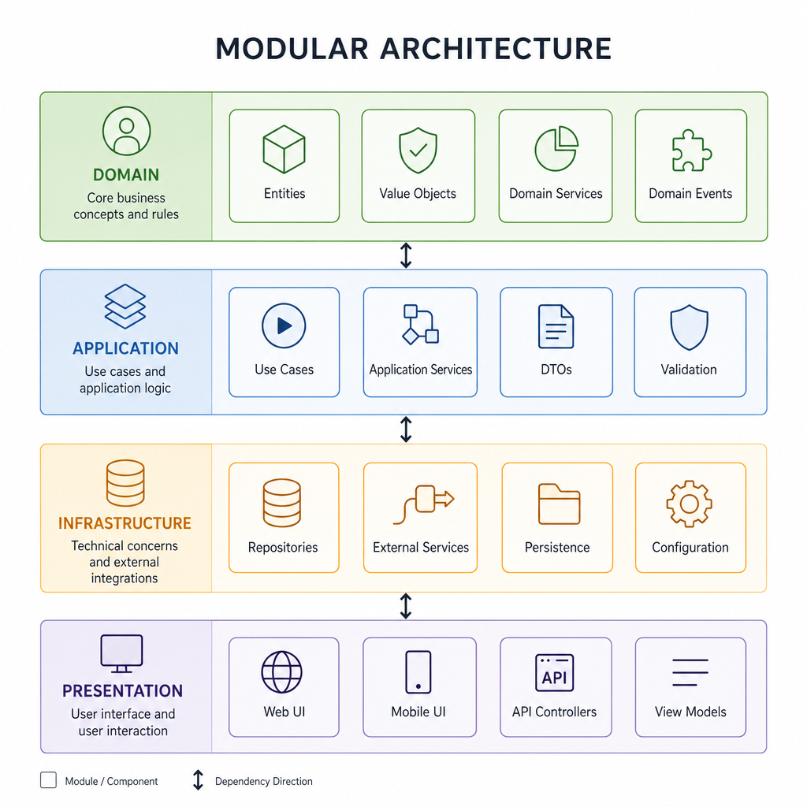
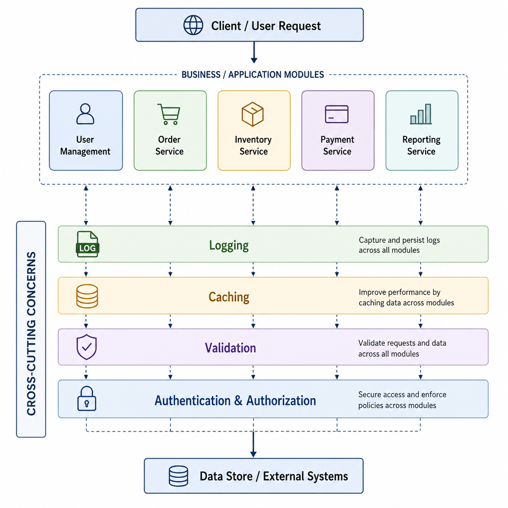
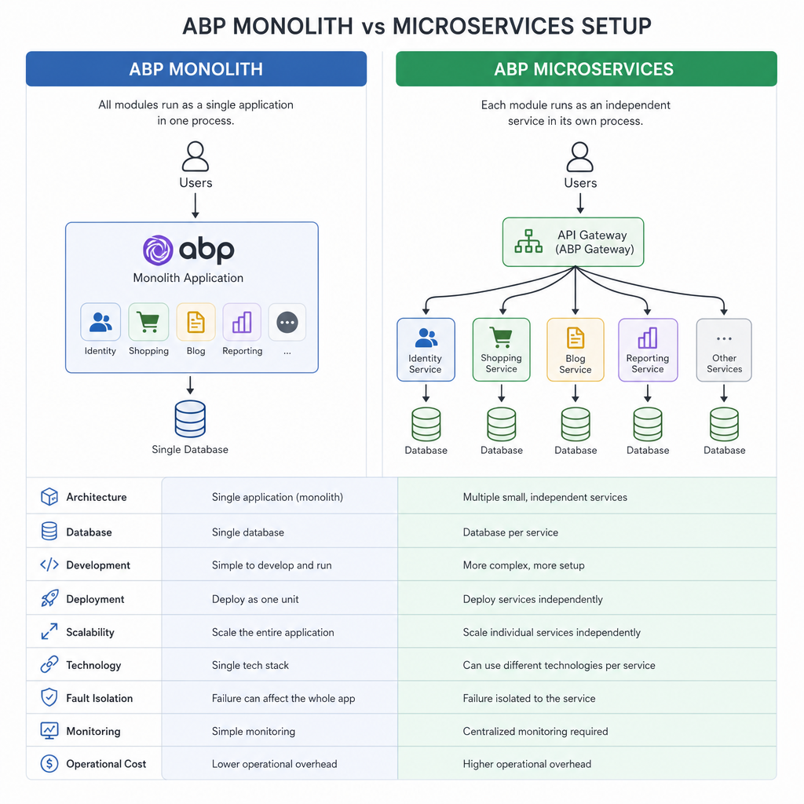

## Introduction: Why Developers Ask "What Is ABP?"

If you’re building enterprise apps in .NET—or planning to—you’ve probably seen ABP (also known as ABP Framework or ABP Platform) pop up in discussions about modularity, clean architecture, and rapid dev. But what is it *really*, and when might it help more than hurt? I’m a developer who used ABP on a few projects, and I want to cover what it *does*, why it was made, and the trade-offs involved.

In short: ABP is a batteries-included framework built on ASP.NET Core, designed to help you build enterprise-grade web apps with best practices baked in, so you can focus on business logic.

Here’s a breakdown of what ABP is—and whether it’s right for your next project.

## What Is ABP in Plain Terms

ABP (from abp.io) is an open-source framework & ecosystem that sits on top of ASP.NET Core, giving you infrastructure, templates, and modules commonly needed in real-world business apps. It supports features like Domain-Driven Design (DDD), modularity, multi-tenancy, UI themes, background jobs, event buses, and more. ABP also offers paid/pro support via “ABP Commercial” plus tools like ABP Suite for code/page generation. ([abp.io](https://abp.io/framework?utm_source=openai))

Some of its core premises:

- Modularity: split your app into reusable, loosely coupled modules. Each module can have UI, APIs, data, domain logic. ([abp.io](https://abp.io/framework?utm_source=openai))
- Layers / Clean Architecture: separates domain, application, infrastructure, presentation layers. Encourages DDD patterns. ([abp.io](https://abp.io/blog/abp/open-source-web-application-development-framework?utm_source=openai))
- Cross-cutting concerns handled out-of-the-box: authentication/authorization, validation, caching, localization, audit logging, exception handling etc. ([abp.io](https://abp.io/framework?utm_source=openai))
- UI & front-end flexibility: multiple UI options like Razor, Angular, Blazor, MAUI etc. ([abp.io](https://abp.io/?utm_source=openai))
- SaaS / multi-tenant readiness: supports different multi-tenant strategies (single/dedicated DB) and helps isolate tenant data. ([abp.io](https://abp.io/framework?utm_source=openai))
- Infrastructure features: event bus, background workers, blob storage, dynamic client proxies, bundling/minification, theming, virtual file system, etc. ([abp.io](https://abp.io/framework?utm_source=openai))

## Components of the ABP Ecosystem

Here are the main pieces you’ll interact with as an ABP user:

| Component | What it offers |
|---|---|
| ABP Framework / Abp.io | The core open-source libraries: modules, templates, utilities, helpers. ([github.com](https://github.com/abpframework/abp?utm_source=openai)) |
| ABP CLI | Command-line tool for scaffolding apps, modules, managing projects. ([abp.io](https://abp.io/framework?utm_source=openai)) |
| ABP Studio / Suite | Tools for productivity: UI and code generation, dashboards; especially in the commercial offering. ([abp.io](https://abp.io/?utm_source=openai)) |
| Startup Templates & Modules | Pre-built modules like Identity, User/Roles, CMS‐kit, SaaS support; themes and UI templates to avoid starting from scratch. ([abp.io](https://abp.io/blog/abp/open-source-web-application-development-framework?utm_source=openai)) |

## When ABP Shines — Use-Cases

Here are projects where ABP can save you time, reduce boilerplate, or help structure the code well:

- Enterprise line-of-business apps with domain complexity: DDD, many entities, aggregate roots, business rules etc.
- Multi-tenant or SaaS platforms where you need to isolate data per tenant, support varying editions or tenants. ABP handles much of the plumbing for this. ([abp.io](https://abp.io/framework?utm_source=openai))
- Projects with multiple UIs (web portal + admin UI + APIs) where standardized themes, UI frameworks help.
- When you want a solid architectural baseline: test support, background jobs, event bus etc., without designing all cross-cutting concerns yourself.
- Microservices or modular monoliths: ABP supports both, with module boundaries and communication (via event buses etc.). ([abp.io](https://abp.io/blog/abp/open-source-web-application-development-framework?utm_source=openai))

## When ABP Might Not Be Ideal

There are trade-offs. ABP adds opinionation and layers. Some scenarios where it might be overkill or misfit:

- Simple CRUD apps without complexity: if all you need is CRUD over a few entities, ABP’s infrastructure may be more overhead than benefit.
- Apps with very tight performance constraints where every layer adds latency; you might prefer minimal stack.
- Highly unconventional architectures: edge cases where ABP’s expectations (modules, layering, conventions) clash with needs.
- Teams unfamiliar with DDD or modular design: learning curve can be steep.
- When deployment must be ultra lean (e.g. serverless functions with tight cold-start limits), much of ABP’s built-in infrastructure may go unused.

## How ABP Compares to Pure ASP.NET Core

| Feature | ASP.NET Core alone | ABP Framework adds / automates |
|---|---|---|
| Project structure | You decide layers, DDD, modularity from scratch | Templates, module system, layered architecture by default |
| Authentication & permission | Use Identity or roll your own | Identity integration + rich permission system |
| UI themes & boilerplate | Lots of setup for UI, theme, Bootstrap etc. | Pre-built themes, tag helpers, UI templates |
| Cross-cutting stuff (logging, validation, caching) | Hand-rolled or via libraries | Integrated, convention-based, DI’d in |
| Multi-tenancy | You build strategy & plumbing | Built-in strategies, tenant resolution, isolation |
| Tooling & generation | Use scaffolding, custom code | ABP CLI, ABP Studio/Suite help scaffold modules, pages, APIs |

If you care about consistency, developer velocity, maintainability in a team or enterprise setting, ABP often wins. If your needs are small or very specific, raw ASP.NET Core might be enough or even better.

## Getting Started: ABP at a Glance

If you decide to try it, here's a minimal flow:

1. Install ABP CLI (via `dotnet tool install -g Volo.Abp.Cli`) and try `abp new MyProject` with a template (e.g. modular monolith).  ([abp.io](https://abp.io/framework?utm_source=openai))
2. Pick your UI layer: Razor Pages, Blazor, Angular, etc — ABP supports multiple options. ([abp.io](https://abp.io/?utm_source=openai))
3. Explore existing modules: Identity, SaaS, CMS Kit etc. You may not need to write your own module if you can reuse. ([abp.io](https://abp.io/blog/abp/open-source-web-application-development-framework?utm_source=openai))
4. Leverage cross-cutting features: validation, exception filters, logging, auditing. Most follow convention, so less wiring up.  ([abp.io](https://abp.io/framework?utm_source=openai))
5. Build business logic in domain layer, expose via application services. Use public templates and tools to speed up CRUD pages if needed. ([abp.io](https://abp.io/blog/abp/open-source-web-application-development-framework?utm_source=openai))

## TL;DR

- ABP is an opinionated framework on ASP.NET Core built for enterprise apps: modular, DDD, and ready for real-world complexities.  
- It gives you built-in modules, themes, tools, and infrastructure so you can stop reinventing common things.  
- Best use cases: business apps with complexity (tenants, user roles, large domains, multiple front-ends).  
- Skip if your app is trivial, performance-tight, or if the overhead of layers hurts more than helps.  
- If you jump in, use the CLI/studio, pick templates, explore modules, lean on conventions.

If you like, I can show you a side-by-side sample project: vanilla ASP.NET Core vs ABP to illustrate real code structure and pros/cons. Want me to pull that together?