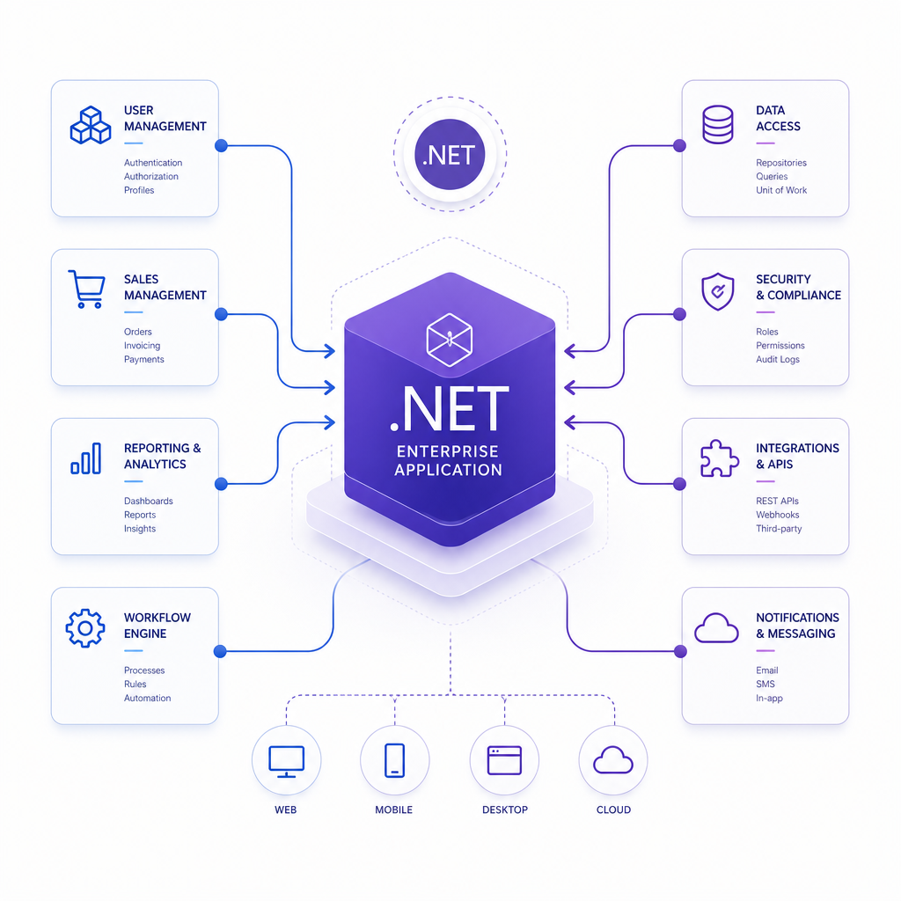

ABP Framework is an open-source application framework for ASP.NET Core that helps developers build modular, maintainable, and scalable business applications.

It is especially useful when a project needs more than basic CRUD and starts requiring structure: authentication, permissions, multi-tenancy, auditing, background jobs, and clear module boundaries.

## What ABP Actually Gives You

ABP is not just a library. It is a full application framework with built-in patterns and infrastructure for enterprise-style .NET development.

Key capabilities include:

- Modular architecture
- Domain-Driven Design support
- Multi-tenancy
- Authentication and authorization
- Validation and auditing
- Background jobs
- Distributed event bus
- Caching and exception handling
- BLOB storage support

It also supports multiple UI approaches such as:

- Angular
- Blazor
- MVC / Razor Pages

And common data access options like:

- Entity Framework Core
- MongoDB

## Why Developers Use It

ABP saves time on the repetitive parts of serious application development.

Instead of wiring common infrastructure from scratch, teams can start with conventions and built-in modules. That makes it a strong fit for:

- SaaS products
- Internal business systems
- Enterprise applications
- Modular monoliths
- Microservice-based systems

In practice, ABP is most valuable when long-term maintainability matters more than keeping the initial setup minimal.

## When to Use It and When Not To

### Use ABP when

- You are building a business application on .NET
- You need modularity and clean boundaries
- You expect the project to grow over time
- You want built-in enterprise features

### Do not use ABP when

- You are building a very small or simple app
- You want the lightest possible stack
- Your team is not ready for ABP's architectural conventions

ABP is powerful, but it comes with a learning curve. For simple apps, plain ASP.NET Core may be enough.

## A Short Practical Definition

If you want a one-line answer:

**ABP is a framework for building structured, enterprise-ready ASP.NET Core applications faster, using modular architecture and built-in infrastructure.**

## TL;DR

- ABP Framework is an open-source framework for ASP.NET Core.
- It helps build modular, scalable, enterprise-style applications.
- It includes built-in features like auth, multi-tenancy, auditing, and background jobs.
- It is a great fit for serious business apps, but often too heavy for very small projects.