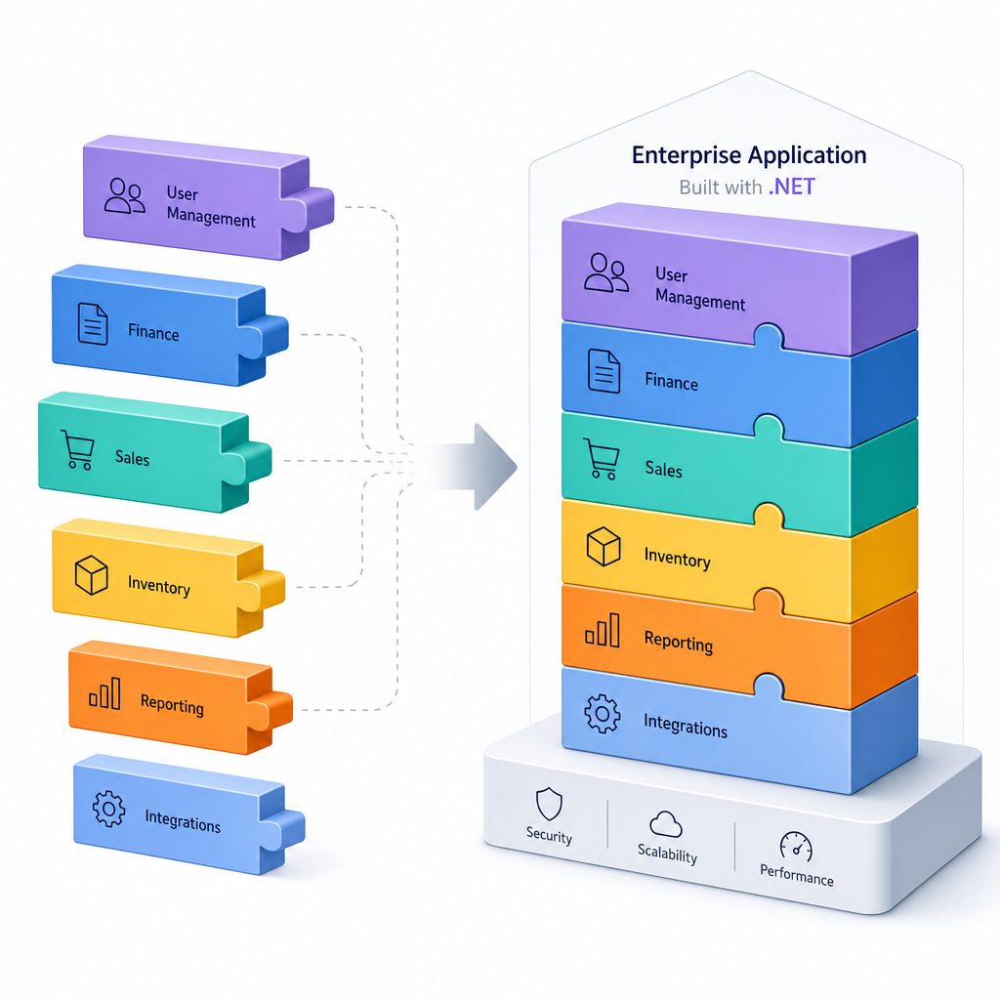

ABP is an open-source application framework for building enterprise-grade .NET applications on top of ASP.NET Core. If plain ASP.NET Core gives you the building blocks, ABP gives you a structured way to assemble them for real business apps.

It is designed for teams that want a consistent architecture from day one, especially for modular monoliths, multi-tenant SaaS apps, and systems that may later grow into microservices.

## What ABP Actually Is

ABP Framework is an opinionated framework for .NET that helps you build maintainable applications faster.

In practice, it gives you:

- A modular architecture
- Built-in support for common enterprise patterns
- Ready-made infrastructure for cross-cutting concerns
- Startup templates and tooling to reduce boilerplate

Instead of wiring everything manually, ABP provides conventions and prebuilt modules so you can focus more on business logic.

## What You Get Out of the Box

Some of the most useful ABP features are:

- **Modularity:** build reusable modules with their own application, domain, and data layers
- **Multi-tenancy:** support single-tenant or SaaS scenarios
- **Authentication and authorization:** integrated security infrastructure
- **Audit logging:** track important actions automatically
- **Background jobs and workers:** handle async and scheduled tasks
- **Localization:** build multilingual applications more easily
- **Data filtering and exception handling:** common infrastructure already in place

ABP also works with common UI options such as MVC/Razor, Blazor, and Angular.

## When ABP Makes Sense

ABP is a good fit when:

- You are building a business application, not a tiny demo app
- Your project needs clear layers and long-term maintainability
- You want built-in support for DDD-style architecture
- You expect multi-tenancy, permissions, auditing, or modular growth

ABP may be too much when:

- Your app is very small and simple
- You want complete architectural freedom with minimal abstraction
- Your team is not ready for the framework's learning curve

## ABP Framework vs Plain ASP.NET Core

A simple way to think about it:

- **ASP.NET Core** gives you flexibility and core primitives
- **ABP** adds structure, conventions, and many enterprise features on top

That makes ABP productive for larger apps, but heavier than starting from scratch.

## Open Source and Pro Edition

The core ABP Framework is open source. There is also a commercial Pro edition that adds premium modules, themes, generators, and extra tooling.

For many teams, the open-source framework is enough to get started.

## TL;DR

- ABP is an open-source framework for building enterprise .NET applications
- It adds modular architecture and built-in infrastructure on top of ASP.NET Core
- It is especially useful for SaaS, multi-tenant, and long-lived business apps
- It can feel heavy for very small projects, but saves time on larger ones