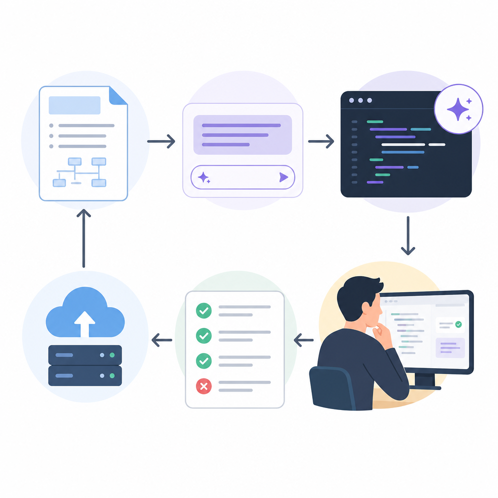

AI tools are already part of daily development. The real question is not whether to use them, but how to use them without creating bugs, security issues, or code nobody understands.

The practical answer is simple: use AI as a fast draft partner, not as the final authority.

## Use AI for speed, not judgment

AI is great at:

- scaffolding boilerplate
- writing repetitive code
- suggesting tests
- explaining unfamiliar code
- helping with refactors

AI is weak at:

- understanding hidden business rules
- handling edge cases without guidance
- making architecture decisions alone
- guaranteeing secure or compliant code

A good rule: let AI save time on typing, but keep human control over logic and design.

## Give it real context

Most bad AI output starts with vague prompts.

Instead of asking for "a repository class" or "fix this bug," provide:

- the relevant file or code snippet
- framework and version
- constraints and coding standards
- expected behavior
- edge cases to respect

The more specific your context, the less likely the model is to invent the wrong solution.

## Treat generated code as a draft

Never paste AI output into production without review.

Check for:

- correctness
- security problems
- performance issues
- missing validation
- test coverage
- consistency with team conventions

If you do not understand the generated code, do not merge it. That is where technical debt starts.

## Use a simple workflow

A reliable AI workflow for developers looks like this:

1. Write a short spec.
2. Break the task into small steps.
3. Ask AI for a focused implementation.
4. Review the result line by line.
5. Run linting, tests, and security checks.
6. Refine or reject the output.

This works much better than asking AI to "build everything" in one shot.

## When to use it and when not to

### When to use AI tools

- CRUD scaffolding
- test generation
- code explanation
- migration planning
- repetitive refactors

### When NOT to rely on AI alone

- security-sensitive code
- payment or compliance logic
- domain-heavy business rules
- production incident response
- major architectural decisions

In those cases, AI can still help, but it should support an experienced developer, not replace one.

## Don't ignore privacy and licensing

Before using any AI coding tool, make sure your team is clear about:

- whether prompts may contain private code or customer data
- whether the tool stores or trains on prompts
- how generated code is reviewed for licensing or IP risk

This matters just as much as code quality.

## TL;DR

- Use AI to accelerate coding, not to replace engineering judgment.
- Give detailed context so the output fits your codebase.
- Treat every generated result as draft code that must be reviewed.
- Run tests, linting, and security checks before trusting AI output.